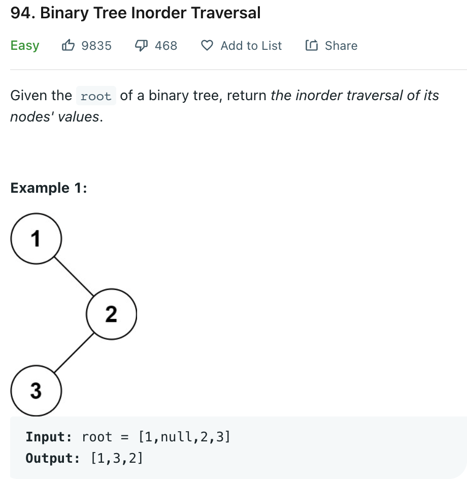

# 0094 Binary Tree Inorder Traversal

[Question](https://leetcode.com/problems/binary-tree-inorder-traversal/)



My solution:

```java
class Solution {
    
    public List<Integer> inorderTraversal(TreeNode root) {
        List<Integer> list = new ArrayList<>();
        in(root, list);
        return list;
    }
    
    private void in(TreeNode root, List<Integer> res){
        if (root == null)
            return;
        in(root.left, res);
        res.add(root.val);
        in(root.right, res);
        
    }
}
```
