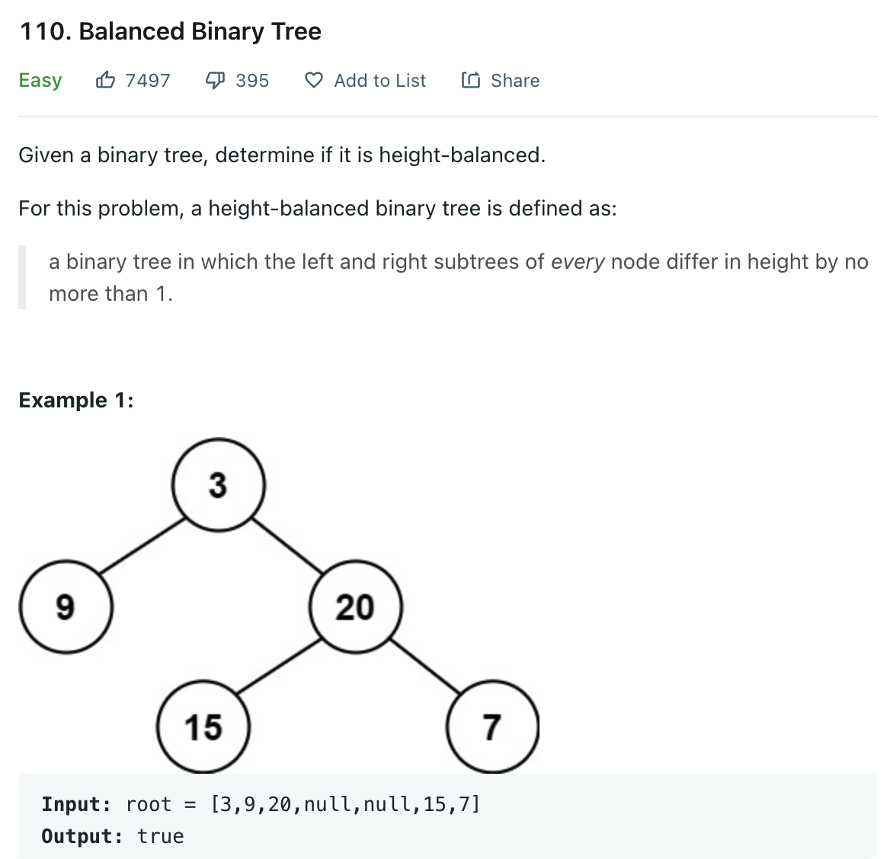

# 0110 Balanced Binary Tree

[Question](https://leetcode.com/problems/balanced-binary-tree/)



My Solution

```java
/**
 * Definition for a binary tree node.
 * public class TreeNode {
 *     int val;
 *     TreeNode left;
 *     TreeNode right;
 *     TreeNode() {}
 *     TreeNode(int val) { this.val = val; }
 *     TreeNode(int val, TreeNode left, TreeNode right) {
 *         this.val = val;
 *         this.left = left;
 *         this.right = right;
 *     }
 * }
 */
class Solution {
    boolean isBalanced = true;
    public boolean isBalanced(TreeNode root) {
        height(root);
        return isBalanced;
    }
    
    
    private int height(TreeNode root){
        if(root == null)
            return -1;
        int left = height(root.left);
        int right = height(root.right);
        
        if(Math.abs(left - right) > 1)
            isBalanced = false;
        
        return Math.max(left, right) + 1;
    }
}
```
