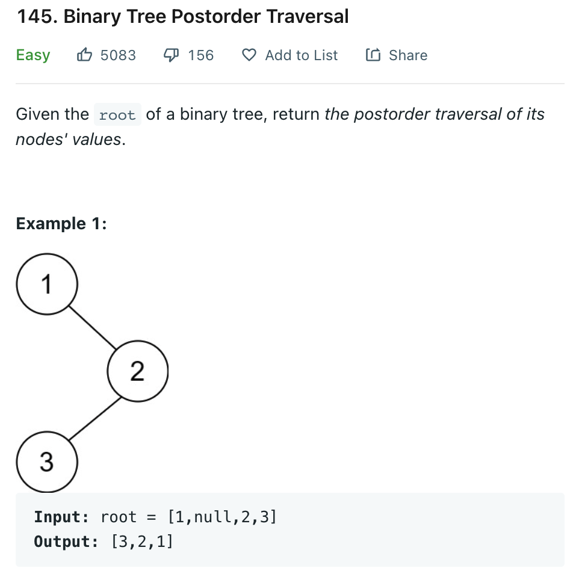

# 0145 Binary Tree Postorder Traversal

[Question](https://leetcode.com/problems/binary-tree-postorder-traversal/)



My Solution:

```java
class Solution {
    public List<Integer> postorderTraversal(TreeNode root) {
        List<Integer> list = new ArrayList<>();
        in(root, list);
        return list;
    }
    
    private void in(TreeNode root, List<Integer> list){
        if(root == null)
            return;
        
        in(root.left, list);
        in(root.right, list);
        list.add(root.val);
    }
}
```
