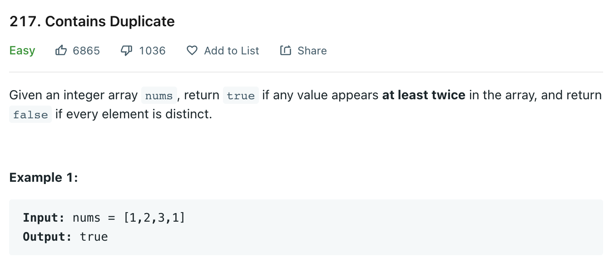

# 0217 Contains Duplicate

[Question](https://leetcode.com/problems/contains-duplicate/)



My Solution:

```java
class Solution {
    public boolean containsDuplicate(int[] nums) {
        HashSet<Integer> s = new HashSet<>();
        for(int i: nums)
        {
            if(s.contains(i)) return true;
            s.add(i);
        }
        return false;
    }
}
```
