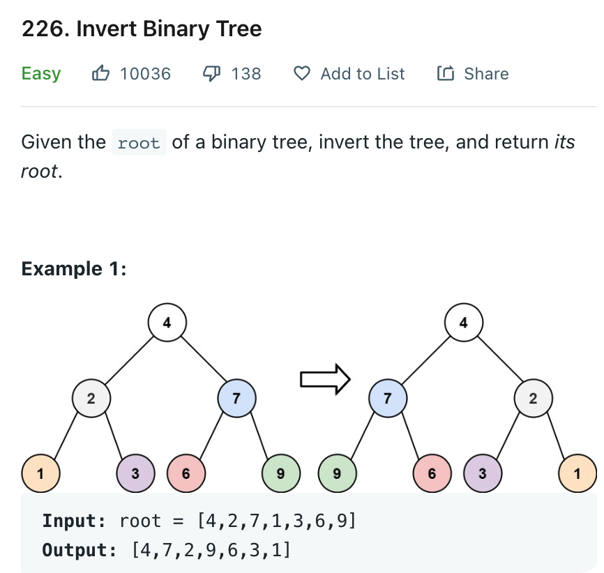

# 0226 Invert Binary Tree

[Question](https://leetcode.com/problems/invert-binary-tree/)



My Solution:

```java
class Solution {
    public TreeNode invertTree(TreeNode root) {
        if(root == null) 
            return null;
        TreeNode tmp = root.left;
        root.left = invertTree(root.right);
        root.right = invertTree(tmp);
        
        return root;
    }
}
```
