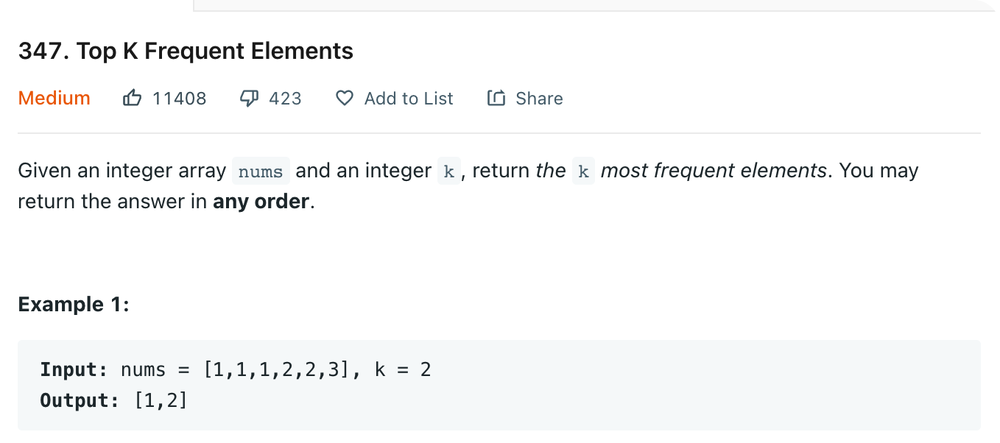

# 0347 Top K Frequent Elements

[Question](https://leetcode.com/problems/top-k-frequent-elements/)



My Solution:

```java
class Solution {
    public int[] topKFrequent(int[] nums, int k) {
        List<Integer>[] bucket = new List[nums.length+1];
        Map<Integer, Integer> frequencyMap = new HashMap<Integer, Integer>();
        
        // count number
        for(int n: nums){
            frequencyMap.put(n, frequencyMap.getOrDefault(n,0) + 1);
        }
        
        for(int key: frequencyMap.keySet()){
            int frequency = frequencyMap.get(key);
            if(bucket[frequency] == null){
                bucket[frequency] = new ArrayList<>();
            }
            bucket[frequency].add(key);
        }
        
        int[] res = new int[k];
        int postion = 0;
        
        // get value from back
        for(int pos = bucket.length -1; pos >= 0 && postion < k; pos--){
            if(bucket[pos] != null){
                for(int i: bucket[pos]){
                    res[postion++] = i; 
                }
            }
        }
        
        return res;
    }
}
```
