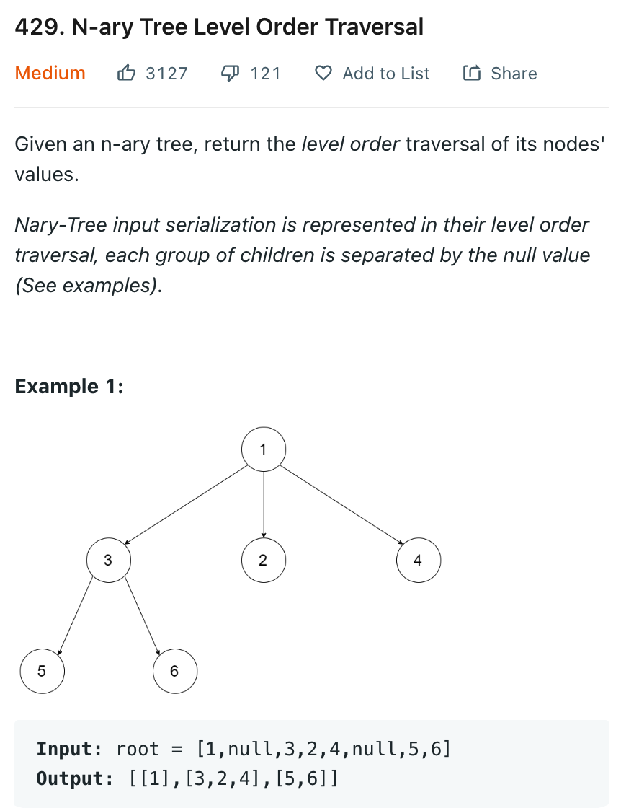

# 0429 N-ary Tree Level Order Traversal

[Question](https://leetcode.com/problems/n-ary-tree-level-order-traversal/)

* Breadth First Search



My Solution

```java
class Solution {
    
    public List<List<Integer>> levelOrder(Node root) {
        List<List<Integer>> res = new ArrayList<>();
        Queue<Node> queue = new LinkedList<>();
        if (root == null)
            return res;
        queue.add(root);
        
        while(!queue.isEmpty()){
            int curLevelLen = queue.size(); // the number of nodes need to store
            List<Integer> curLevel = new ArrayList<>();
            for(int i =0; i < curLevelLen; i++){
                
                Node cur = queue.poll();
                curLevel.add(cur.val);
                
                // add chidlre to queue
                int numChildren = cur.children.size();
                for(int c = 0; c < numChildren; c++){
                    if(cur.children.get(c) != null)
                        queue.add(cur.children.get(c));
                }
            }
            res.add(curLevel);
        }// end while
        return res;
    }
}
```
