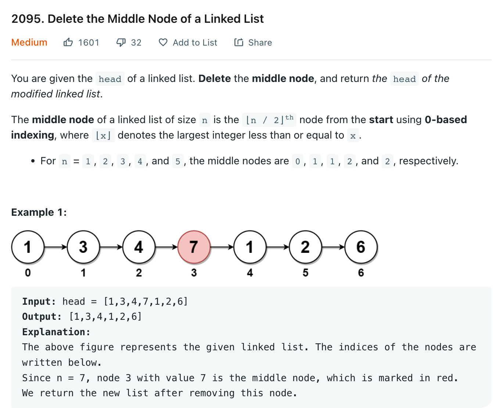

# 2095 Delete the Middle Node of a Linked List

[Question](https://leetcode.com/problems/delete-the-middle-node-of-a-linked-list/)



My Solution:

```java
/**
 * Definition for singly-linked list.
 * public class ListNode {
 *     int val;
 *     ListNode next;
 *     ListNode() {}
 *     ListNode(int val) { this.val = val; }
 *     ListNode(int val, ListNode next) { this.val = val; this.next = next; }
 * }
 */
class Solution {
    public ListNode deleteMiddle(ListNode head) {
        int p = getMiddle(head);
        if(p == 0){
            return null;
        }
        ListNode pointer = head;
        for(int i=0; i < p-1; i++){
            pointer = pointer.next;
        }
        
        pointer.next = pointer.next.next;
        return head;
    }
    
    private int getMiddle(ListNode head){
        if(head == null){
            return 0;
        }
        int length = 1;
        ListNode pointer = head;
        while(pointer.next != null){
            length += 1;
            pointer = pointer.next;
        }
        
        return length / 2;
    }
}
```
