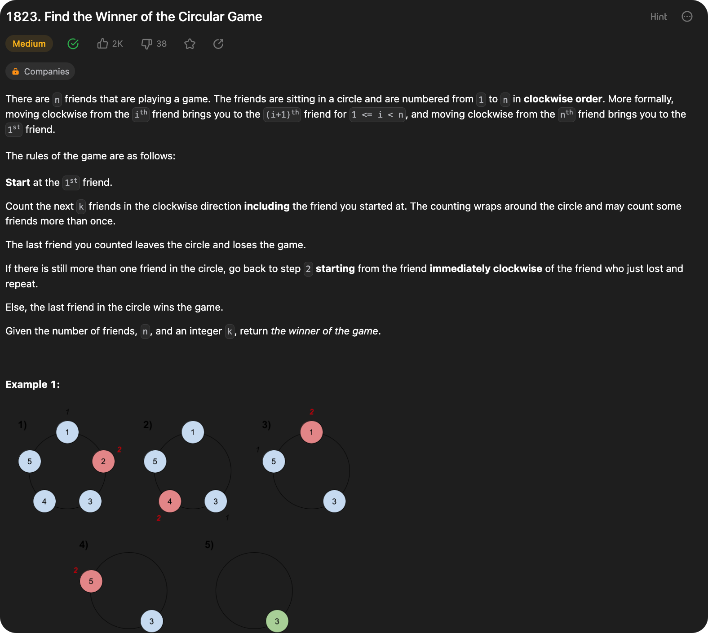

# 0707 Design Linked List

[Question](https://leetcode.com/problems/design-linked-list/description/?envType=study-plan\&id=data-structure-ii)

<figure><figcaption></figcaption></figure>


My Solution:

```java
class MyLinkedList {


    private int size;
    private int[] list = new int[1000];

    public MyLinkedList() {
        size = 0;
    }
    
    public int get(int index) {
        if(index < 0 || index > size - 1){
            return -1;
        }
        return list[index];
    }
    
    public void addAtHead(int val) {
        for(int i = size; i > 0; i--){
            list[i] = list[i-1];
        }
        list[0] = val;
        size++;
    }
    
    public void addAtTail(int val) {
        list[size] = val;
        size++;
    }
    
    public void addAtIndex(int index, int val) {
        if(index > size){
            return;
        }else{
            for(int i = size; i > index; i--){
                list[i] = list[i-1];
            }
        }
        list[index] = val;
        size++;
    }
    
    public void deleteAtIndex(int index) {
        if(index < size && index >= 0){
            for(int i = index; i < size - 1; i++){
                list[i] = list[i+1];
            }
            list[size - 1] = 0;
            size--;
        }
    }
}

/**
 * Your MyLinkedList object will be instantiated and called as such:
 * MyLinkedList obj = new MyLinkedList();
 * int param_1 = obj.get(index);
 * obj.addAtHead(val);
 * obj.addAtTail(val);
 * obj.addAtIndex(index,val);
 * obj.deleteAtIndex(index);
 */
```
