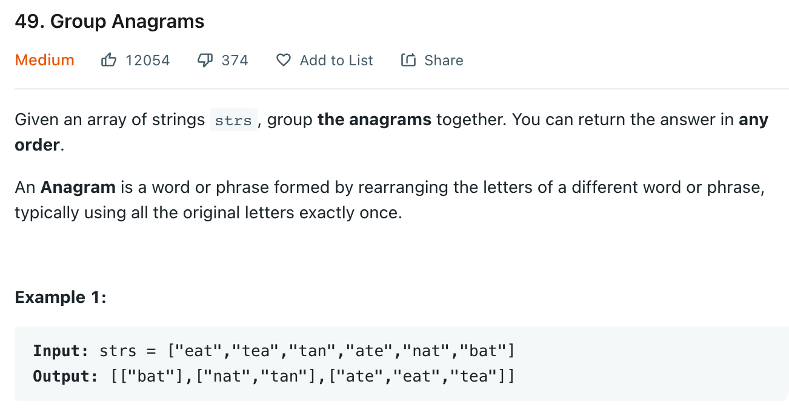

# 0049 Group Anagrams

[Question](https://leetcode.com/problems/group-anagrams/)

<figure><figcaption></figcaption></figure>

My Solution:

```java
class Solution {
    public List<List<String>> groupAnagrams(String[] strs) {
        Map<String, List<String>> res = new HashMap<>();
        
        for(String s: strs){
            char[] char_s = s.toCharArray();
            Arrays.sort(char_s); 
            String sorted_s = String.valueOf(char_s);
            if(!res.containsKey(sorted_s)){
                res.put(sorted_s, new ArrayList<>());
            }
            res.get(sorted_s).add(s);
                
        }
        
        return new ArrayList<>(res.values());
    }
}
```
