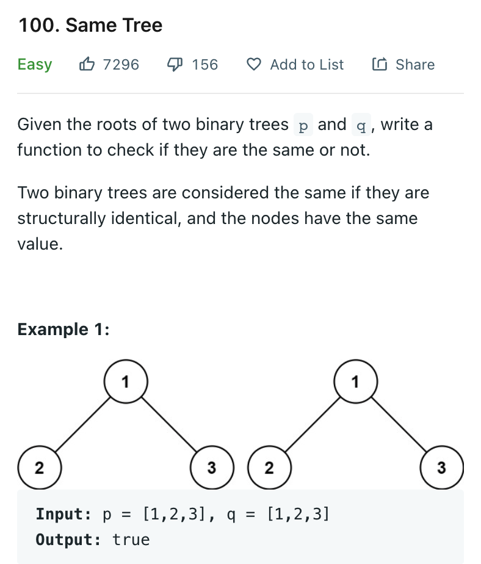

# 0100 Same Tree

[Question](https://leetcode.com/problems/same-tree/)



My Solution:

```java
class Solution {
    public boolean isSameTree(TreeNode p, TreeNode q) {
        if(p == null && q == null)
            return true;
        if(p == null && q!= null || p != null && q == null)
            return false;
        if(p.val != q.val) 
            return false;
        return isSameTree(p.left, q.left) && isSameTree(p.right, q.right);
    }   
}
```
