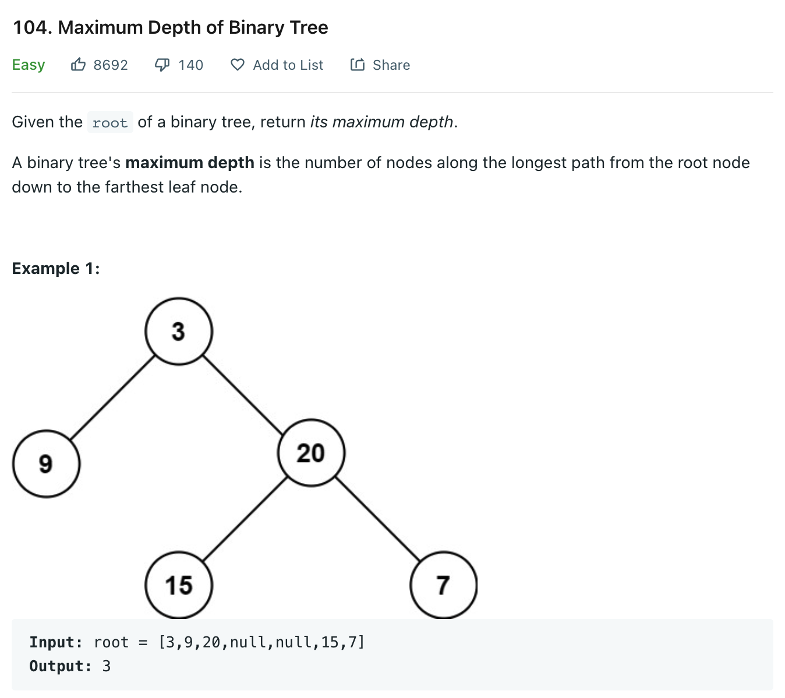

# 0104 Maximum Depth of Binary Tree

[Question](https://leetcode.com/problems/maximum-depth-of-binary-tree/)

<figure><figcaption></figcaption></figure>

My Solution:

Recursive DFS

```java
/**
 * Definition for a binary tree node.
 * public class TreeNode {
 *     int val;
 *     TreeNode left;
 *     TreeNode right;
 *     TreeNode() {}
 *     TreeNode(int val) { this.val = val; }
 *     TreeNode(int val, TreeNode left, TreeNode right) {
 *         this.val = val;
 *         this.left = left;
 *         this.right = right;
 *     }
 * }
 */
class Solution {
    
    
    public int maxDepth(TreeNode root) {
        if(root == null) 
            return 0;
        int leftMax = maxDepth(root.left);
        int rightMax = maxDepth(root.right);
        
        return Math.max(leftMax, rightMax) + 1;
    }
}
```


## Python

Bread First Search

```python
# Definition for a binary tree node.
# class TreeNode:
#     def __init__(self, val=0, left=None, right=None):
#         self.val = val
#         self.left = left
#         self.right = right
class Solution:
    def maxDepth(self, root: Optional[TreeNode]) -> int:
        if not root:
            return 0
        
        level = 0
        q = deque([root])
        while q: # while q is not empty
            for i in range(len(q)):
                node = q.popleft()
                if node.left: # node have left child
                    q.append(node.left)
                if node.right:
                    q.append(node.right)
            
            level += 1
        
        return level
```
