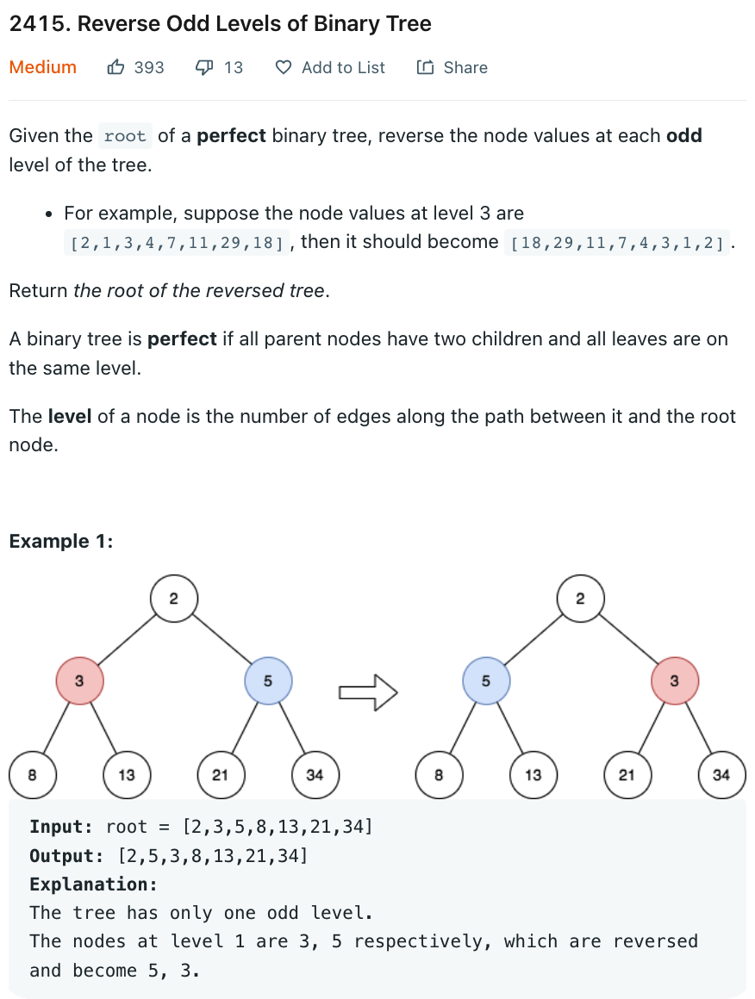

# 2415 Reverse Odd Levels of Binary Tree

[Question](https://leetcode.com/problems/reverse-odd-levels-of-binary-tree/)

* Breadth-First Search



My Solution

```java
class Solution {
    public TreeNode reverseOddLevels(TreeNode root) {
        if (root == null)
            return root;
        
        Queue<TreeNode> q = new LinkedList<>();
        q.offer(root);
        int level = 0;
        
        while( !q.isEmpty()){
            int size = q.size();
            
            while(size-- > 0){
                TreeNode node = q.poll();
                if (node.left != null) 
                    q.offer(node.left);
                if(node.right != null) 
                    q.offer(node.right);
            }
            level++;
            
            if( level % 2 == 1 && !q.isEmpty()){
                int[] nums = new int[q.size()];
                
                int i = 0;
                for(TreeNode node: q){
                    nums[i++] = node.val;
                }
                
                int j = q.size() - 1;
                for(TreeNode node: q){
                    node.val = nums[j--];
                }
            }
        }// end while
        return root;
    }
}
```
