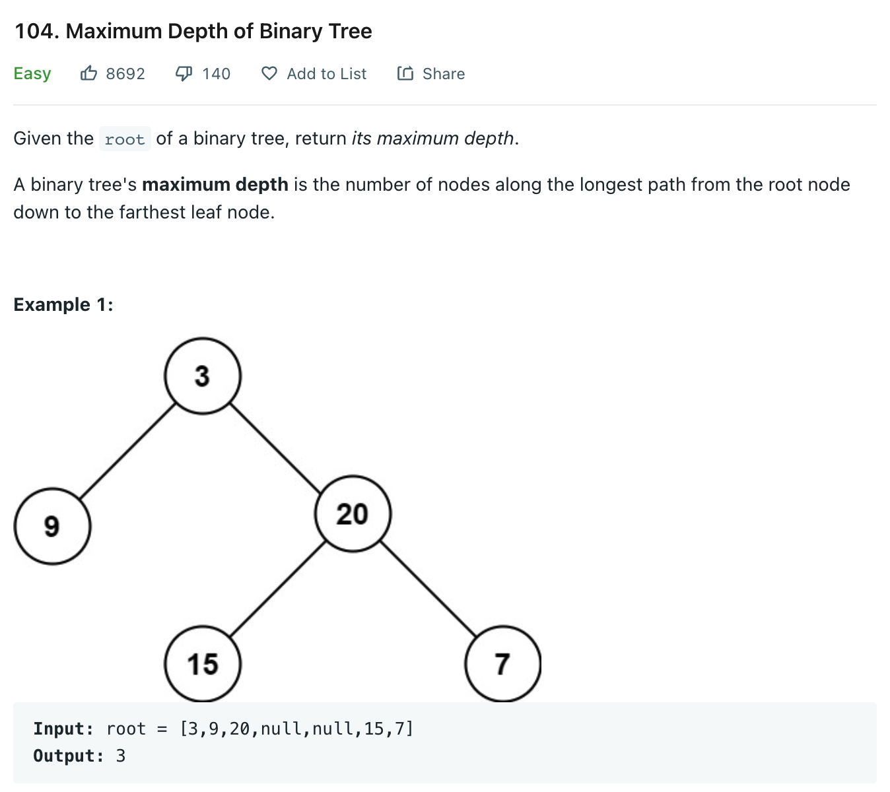

# 0104 Maximum Depth of Binary Tree

[Question](https://leetcode.com/problems/maximum-depth-of-binary-tree/)



My Solution:

```java
/**
 * Definition for a binary tree node.
 * public class TreeNode {
 *     int val;
 *     TreeNode left;
 *     TreeNode right;
 *     TreeNode() {}
 *     TreeNode(int val) { this.val = val; }
 *     TreeNode(int val, TreeNode left, TreeNode right) {
 *         this.val = val;
 *         this.left = left;
 *         this.right = right;
 *     }
 * }
 */
class Solution {
    
    
    public int maxDepth(TreeNode root) {
        if(root == null) 
            return 0;
        int leftMax = maxDepth(root.left);
        int rightMax = maxDepth(root.right);
        
        return Math.max(leftMax, rightMax) + 1;
    }
}
```
