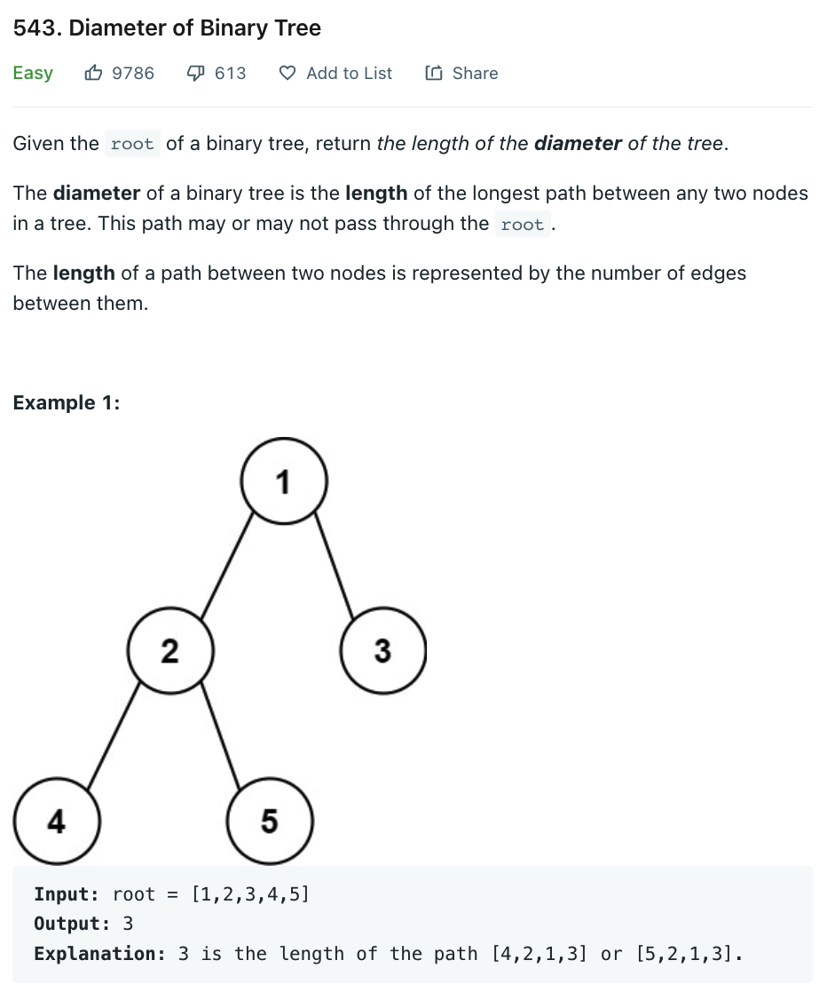

# 0543 Diameter of Binary Tree

[Question](https://leetcode.com/problems/diameter-of-binary-tree/)



My Solution:

```java
/**
 * Definition for a binary tree node.
 * public class TreeNode {
 *     int val;
 *     TreeNode left;
 *     TreeNode right;
 *     TreeNode() {}
 *     TreeNode(int val) { this.val = val; }
 *     TreeNode(int val, TreeNode left, TreeNode right) {
 *         this.val = val;
 *         this.left = left;
 *         this.right = right;
 *     }
 * }
 */
class Solution {
    int ans = 0;
    public int diameterOfBinaryTree(TreeNode root) {
        
        height(root);
        return ans;
    }
    
    public int height(TreeNode root){
        if(root==null)
            return -1;
        
        int L=height(root.left);
        int R=height(root.right);
        
        ans=Math.max(ans,L+R+2);

        return 1+Math.max(L,R);
    }
}
```
