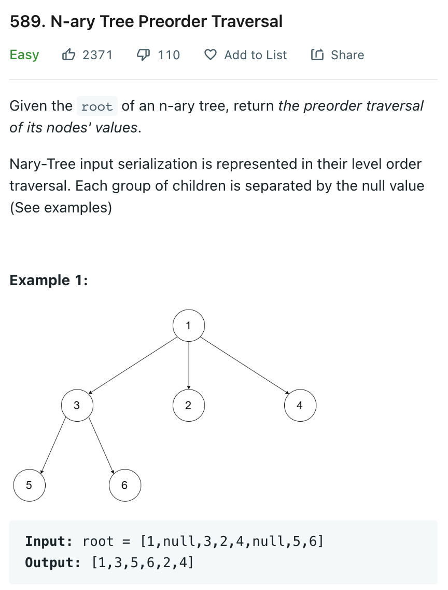

# 0589 N-ary Tree Preorder Traversal

[Question](https://leetcode.com/problems/n-ary-tree-preorder-traversal/)



My Solution:

```java
class Solution {
    List<Integer> res = new ArrayList<>();
    public List<Integer> preorder(Node root) {
        in(root);
        return res;
    }
    
    private void in(Node root){
        if(root == null)
            return;
        res.add(root.val);
        for (Node n: root.children){
            in(n);
        }
    }
}
```
