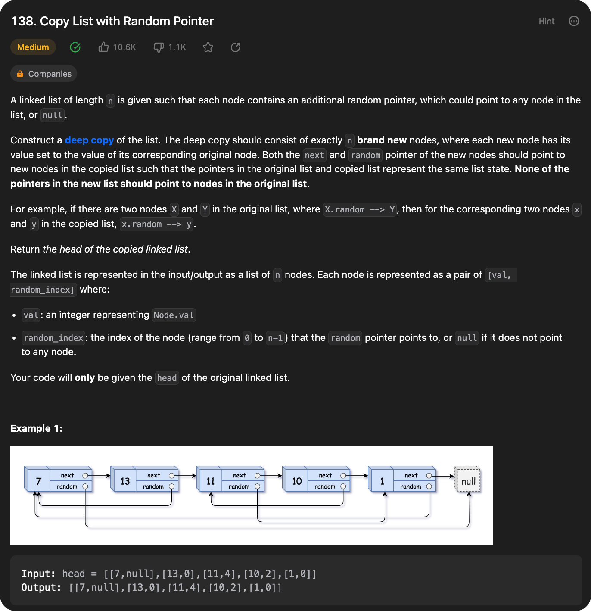

# 0011 Container With Most Water

[Question](https://leetcode.com/problems/container-with-most-water/)

<figure><figcaption></figcaption></figure>


My Solution:

```java
class Solution {
    public int maxArea(int[] height) {
        int ans = 0;
        int left = 0;
        int right = height.length - 1;
        int temp = 0;
        
        while(left < right){
            if(height[left] < height[right]){
                temp = height[left] * (right - left);
                left++;
            }else{
                temp = height[right] * (right - left);
                right--;
            }
            
            ans = Math.max(ans, temp);
        }
        return ans;
    }
}
```
